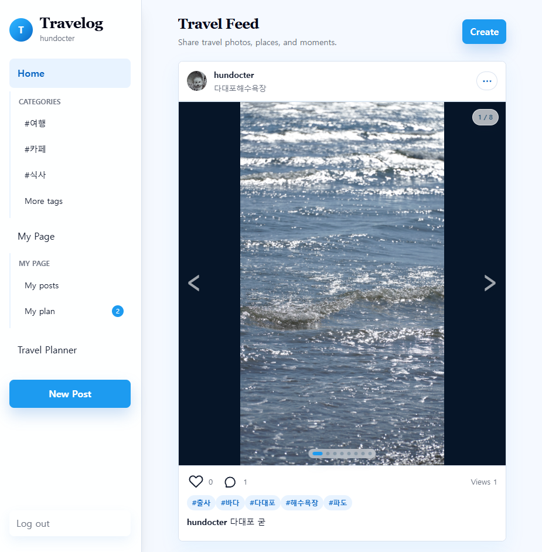
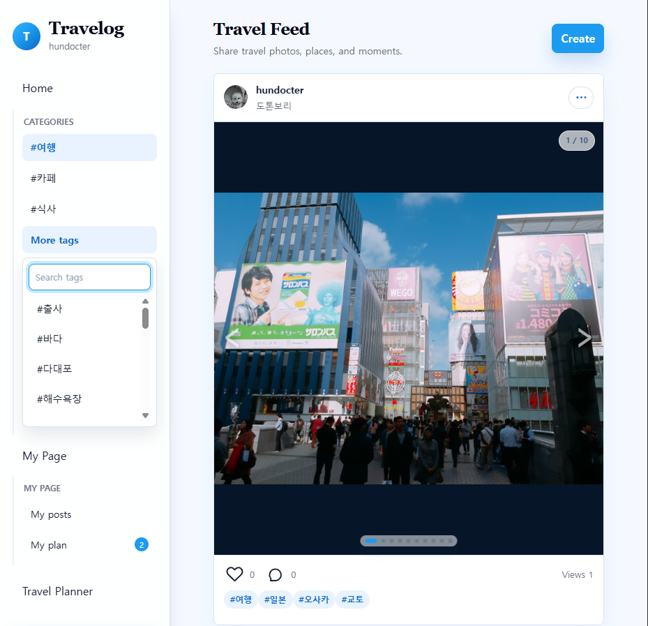
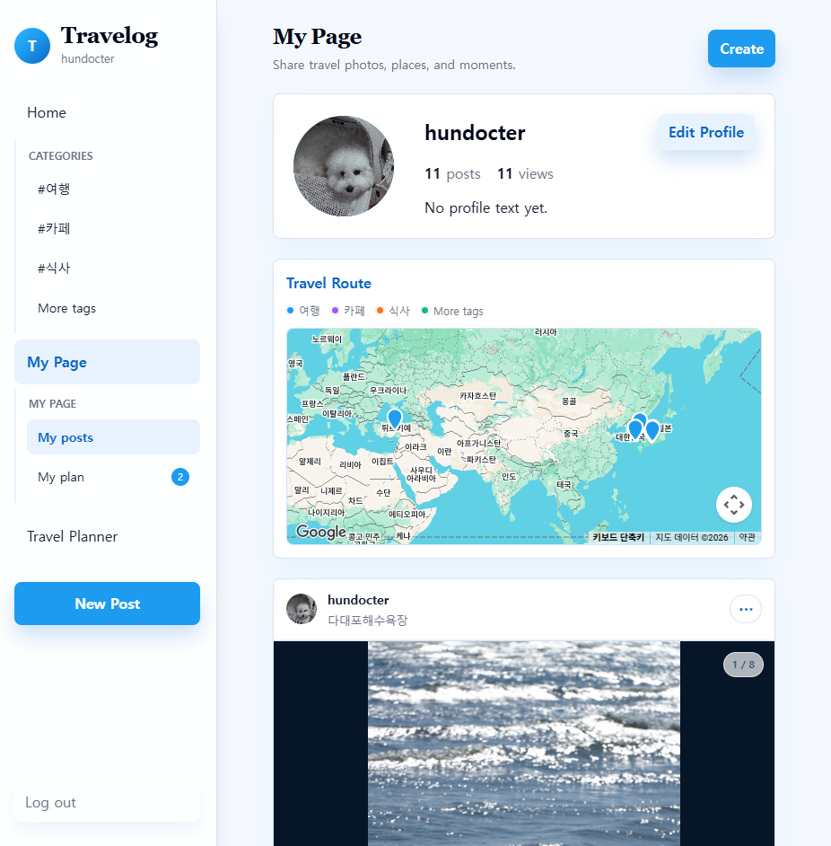
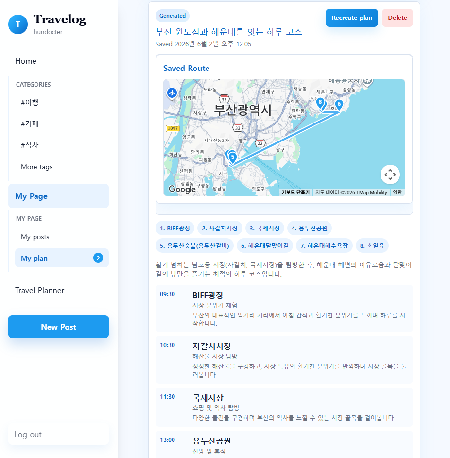
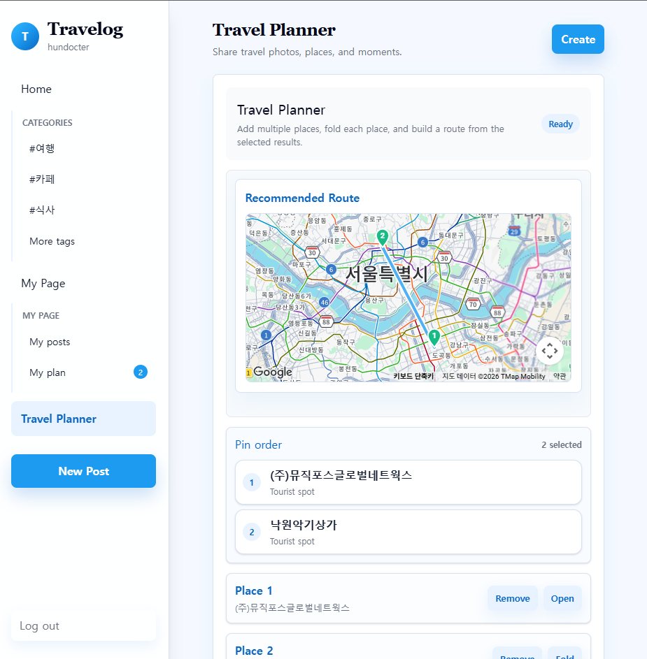
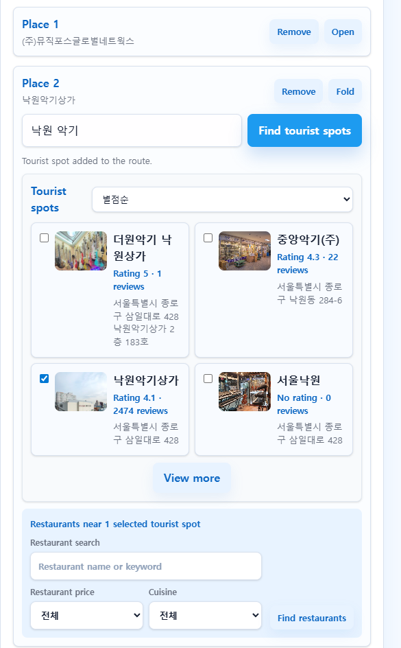

# Travelog

**Travelog**는 여행 사진 피드와 여행 경로 계획 기능을 제공하는 웹 서비스이다.
사용자는 여러 장의 사진, 태그, 댓글, 좋아요, 조회수, 지도 위치를 포함한 여행 게시글을 업로드할 수 있다. 또한 관광지와 음식점을 선택해 여행 경로를 만들고, 선택한 핀 순서를 저장한 뒤 `My Plan`에서 AI 기반 하루 여행 일정을 생성할 수 있다.

## 화면 및 주요 기능

### 여행 피드



홈 화면에서는 여행 게시글을 소셜 피드 형태로 확인할 수 있다.

- 여러 이미지를 볼 수 있는 캐러셀 기능
- 이미지 개수 표시 및 이전/다음 이동 기능
- 게시글 작성자, 설명, 태그, 좋아요, 댓글, 조회수 표시
- Home, My Page, Travel Planner, 게시글 작성 메뉴를 포함한 사이드바
- 기본 여행 카테고리를 빠르게 선택할 수 있는 필터 기능

### 태그 검색 및 필터링



사이드바에서는 자주 사용하는 기본 카테고리를 확인하고, 게시글에서 수집된 추가 태그를 검색할 수 있다.

- 기본 태그: travel, cafe, food
- 게시글에서 수집된 동적 태그를 확인할 수 있는 더보기 드롭다운
- 태그 이름 검색 기능
- 선택한 카테고리를 강조 표시하여 현재 피드 필터 확인 가능

### 마이페이지



마이페이지에서는 프로필 정보, 여행 지도, 사용자가 작성한 게시글을 한 번에 확인할 수 있다.

- 프로필 이미지, 사용자 이름, 게시글 수, 조회수를 포함한 프로필 카드
- 프로필 정보 수정 기능
- 사용자의 게시글 위치를 기반으로 구성되는 여행 경로 지도
- `My Posts`와 `My Plan`을 분리한 사이드바 하위 메뉴

### My Plan



`My Plan`에서는 Travel Planner에서 생성한 여행 경로를 저장하고, 저장된 핀 순서를 기반으로 AI 여행 일정을 생성할 수 있다.

- 번호가 표시된 핀과 경로선을 포함한 저장된 여행 지도
- Travel Planner에서 저장한 장소 순서 목록
- AI 여행 일정 생성을 위한 `Create Plan` / `Recreate Plan` 버튼
- 생성 상태, 저장 시간, 생성 시간, 요약, 타임라인 단계 표시
- 저장된 여행 계획 삭제 기능

### Travel Planner 경로 생성



Travel Planner에서는 여행 경로를 시각적으로 구성한 뒤 `My Plan`에 저장할 수 있다.

- 선택한 장소를 기반으로 추천 경로 지도 갱신
- 선택한 장소의 핀 순서 목록 표시
- 드래그 앤 드롭을 통한 경로 순서 변경
- 여러 장소 추가, 접기, 펼치기, 삭제 기능
- 선택한 지도 위치와 경로 순서를 Oracle 데이터베이스에 저장

### 관광지 및 음식점 검색



각 여행 장소에서는 관광지와 음식점을 검색할 수 있다.

- 지역 또는 키워드 기반 관광지 검색
- 여러 관광지를 선택하여 여행 경로에 추가
- 평점, 리뷰 수, 주소, 이미지 정보 표시
- 선택한 관광지 주변 음식점 검색
- 키워드, 가격대, 음식 종류를 활용한 음식점 필터링

## 주요 기능

### 게시글

- 회원가입 및 로그인
- 여행 게시글 생성, 수정, 삭제
- 게시글당 여러 이미지 업로드
- 게시글 카테고리 및 필터링 기능
- 게시글 지도 위치 추가
- 선택한 위치 순서 변경
- 태그 추가 및 AI 태그 추천 요청
- 좋아요 기능
- 게시글 댓글 생성, 수정, 삭제
- 게시글 조회수 기능

### 지도

- Google Maps 연동
- 지도 마커 및 라벨 표시
- 지도 마커 경로선 표시
- Google Places 기반 장소 검색
- 주소 검색 및 역지오코딩
- 지도 클릭을 통한 위치 선택

### Travel Planner

- 관광지 검색
- 선택한 관광지 주변 음식점 검색
- 여러 장소를 선택해 여행 경로 구성
- 드래그 앤 드롭으로 핀 순서 변경
- 구성한 경로 데이터를 백엔드에 저장
- `My Plan`에서 저장된 경로를 기반으로 AI 여행 일정 생성

### AI

- Ollama 기반 AI 태그 추천
- Ollama 기반 여행 일정 생성
- Spring AI를 사용한 Ollama 연동
- 로컬 AI 모델을 활용한 일정 추천

현재 사용 중인 모델 설정 위치:

```text
drive/src/main/resources/application.properties
```

```properties
spring.ai.ollama.base-url=http://localhost:11434
spring.ai.ollama.chat.options.model=gemma4:latest
spring.ai.ollama.chat.options.temperature=0.3
```

여행 일정 생성 프롬프트 관리 위치:

```text
drive/src/main/java/com/example/drive/service/TravelRecommendationService.java
```

AI 태그 추천 프롬프트 관리 위치:

```text
drive/src/main/java/com/example/drive/service/AiTagSuggestionService.java
```

## 기술 스택

### Frontend

- React
- Vite
- JavaScript
- Tailwind CSS
- Google Maps JavaScript API
- Google Places API

### Backend

- Spring Boot
- Spring Security
- JWT
- Spring Data JPA / Hibernate
- Oracle Database
- Spring AI with Ollama
- Local file storage

## 시스템 구조

Travelog는 React 기반 프론트엔드, Spring Boot 기반 백엔드, Oracle Database, Ollama 로컬 AI, Google Maps API로 구성된다.

사용자는 프론트엔드 화면에서 게시글 작성, 여행 경로 생성, AI 일정 생성 등의 기능을 수행한다. 프론트엔드는 백엔드 REST API에 필요한 데이터를 요청하고, 백엔드는 요청에 따라 사용자 인증, 게시글 관리, 이미지 저장, 여행 계획 저장, AI 요청 처리를 수행한 뒤 결과를 반환한다. 데이터는 Oracle Database에 저장되며, 지도 기능은 Google Maps API와 Google Places API를 통해 제공된다.

## 데이터베이스

주요 Oracle 스키마는 다음 테이블로 구성된다.

| 테이블명             |                          |
| -------------------- | ------------------------ |
| `USERS`              | 사용자 정보 저장         |
| `POSTS`              | 게시글 정보 저장         |
| `POST_IMAGES`        | 게시글 이미지 정보 저장  |
| `POST_LOCATIONS`     | 게시글 위치 정보 저장    |
| `COMMENTS`           | 댓글 정보 저장           |
| `POST_LIKES`         | 좋아요 정보 저장         |
| `POST_VIEWS`         | 조회수 정보 저장         |
| `TRAVEL_PLANS`       | 여행 계획 정보 저장      |
| `TRAVEL_PLAN_PLACES` | 여행 계획 장소 정보 저장 |
| `TRAVEL_PLAN_STEPS`  | AI 여행 일정 단계 저장   |

Travel Planner의 저장된 여행 계획은 다음 SQL 파일을 사용한다.

```text
drive/oracle-travel-plan-schema.sql
```

`TRAVEL_PLAN_PLACES` 테이블은 지도 및 경로 데이터를 저장한다.

| 컬럼명       |                |
| ------------ | -------------- |
| `PLAN_ID`    | 여행 계획 ID   |
| `SORT_ORDER` | 장소 방문 순서 |
| `PLACE_NAME` | 장소 이름      |
| `PLACE_KIND` | 장소 유형      |
| `ADDRESS`    | 장소 주소      |
| `LATITUDE`   | 위도           |
| `LONGITUDE`  | 경도           |

## 로컬 실행 방법

### Backend

```powershell
cd drive
.\gradlew.bat bootRun
```

백엔드는 기본적으로 `8080` 포트에서 실행된다.

### Frontend

```powershell
cd drive-front
npm install
npm run dev
```

프론트엔드 개발 서버는 일반적으로 `5173` 포트에서 실행되며, 해당 포트가 사용 중인 경우 다음 사용 가능한 Vite 포트로 실행된다.

### Google Maps 설정

`drive-front/.env` 파일을 생성하고 아래 내용을 추가한다.

```env
VITE_GOOGLE_MAPS_API_KEY=your_google_maps_api_key
```

## 검증 방법

### Backend

```powershell
cd drive
.\gradlew.bat test
```

### Frontend

```powershell
cd drive-front
npm run lint
npm run build
```
